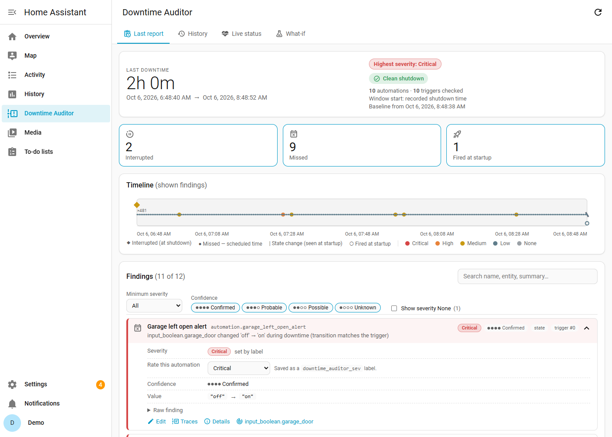
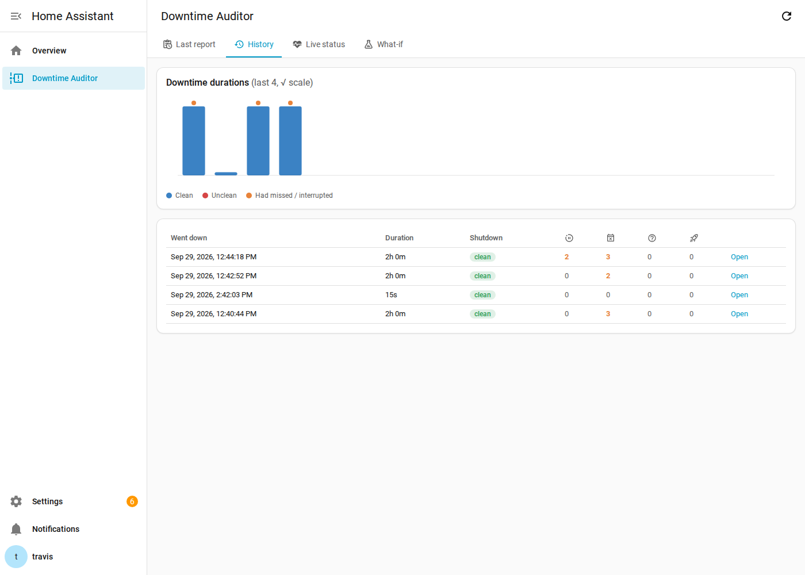
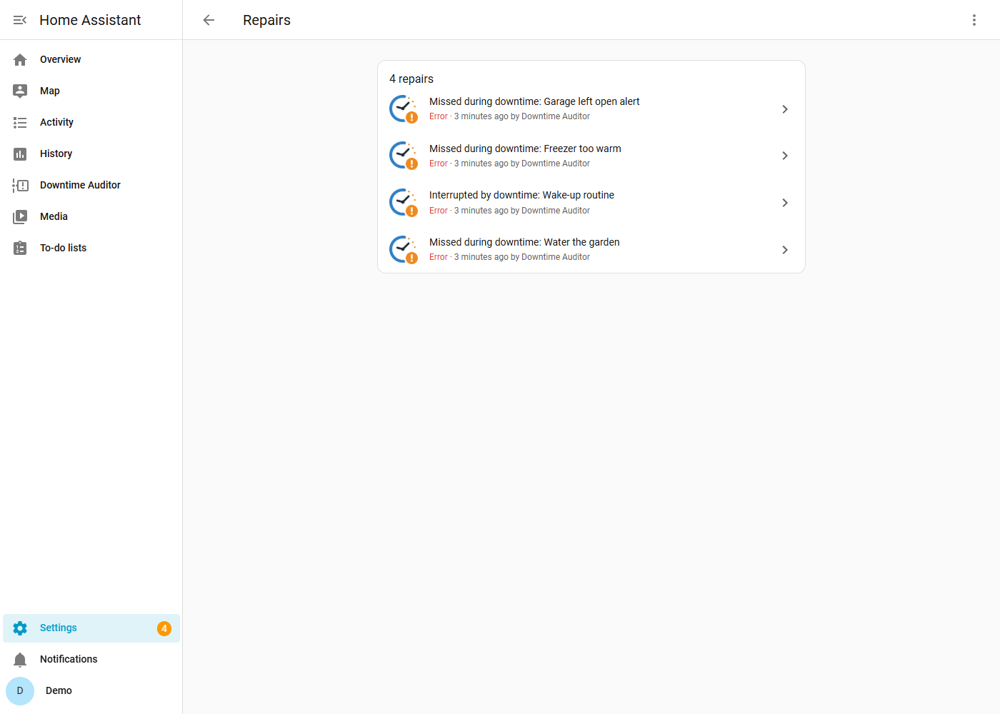
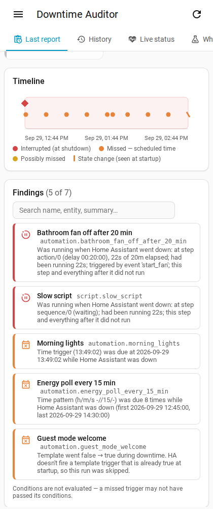

# Downtime Auditor for Home Assistant
[](https://hacs.xyz)
[](https://github.com/permster/ha-downtime-auditor/releases)
[](https://github.com/permster/ha-downtime-auditor/actions/workflows/validate.yaml)

After every restart, crash or power loss, Downtime Auditor tells you:

- **Interrupted:** every automation and script that was mid-run when HA went down. It shows the step it was stuck on (for example `delay 00:10:00`), how far it had got, and what triggered it.
- **Missed:** every automation trigger that should have fired while HA was down: time, time pattern, sun, calendar, state, numeric state, template, zone and device triggers, plus event-style triggers (event, webhook, MQTT, tag, conversation) whose messages were lost.
- **Fired at startup:** automations that fired in the first N seconds after boot. These are often spurious `unavailable → on` transitions.

Each finding also says **how sure** it is (confidence) and **how much it matters** (severity, which you set per automation with a label). It checks the automation's **conditions** at the missed time, so a trigger whose conditions would have failed doesn't bother you. See [Severity, confidence and conditions](#severity-confidence-and-conditions).

It only reports. It never re-runs anything.

Results show up in four places:

1. **A sidebar dashboard** (admins only) with four tabs:
   - **Last report:** a summary, type tiles and filters (minimum severity, confidence, show None), a timeline of the downtime colored by severity, and a searchable list of findings. Each finding expands to show its severity and why, a selector to rate the automation, the condition check, before/after values, due times and the step a run stopped at, with links to the automation's editor and traces (Ctrl/middle-click opens a new tab). The dashboard remembers where you were when you come back from the editor.
   - **History:** every restart, with a duration chart. Click an entry to open its full report.
   - **Live status:** heartbeat health, what's running right now (what *would* be interrupted if HA stopped this instant, with how long it has been running and the step it's on; it updates as soon as an automation or script starts or finishes), and a button to create the severity labels.

   Right after a restart, the dashboard shows when the new report will be ready (it waits for the *startup settle delay* first), and updates by itself when it arrives. If the integration was updated while the page was open, it asks you to reload.
   - **What-if:** pick any time window and see which scheduled triggers a downtime then would miss.
2. **Settings → Repairs:** one issue per automation or script with a finding at or above a minimum severity (all its missed triggers are listed in the issue), the way Spook raises its issues. Previous issues are replaced by each new report. You can ignore them individually or clear them with a service.
3. **Entities** (Watchman-style) on a *Downtime Auditor* device: one count sensor per finding type, with the findings in a `findings` attribute (excluded from the recorder), a highest-severity sensor, duration and timestamp sensors, and problem binary sensors.
4. **JSON history** under `/config/downtime_auditor/` (see [History and retention](#history-and-retention)), plus an optional phone push. A persistent notification is also available but is off by default.



| History | Repairs | Mobile |
|---|---|---|
|  |  |  |

## How it works

| Phase | What happens |
|---|---|
| While running | Every *heartbeat* (default 60 s), it saves to `.storage`: the state of every entity your triggers reference, the current result of every template trigger, each automation's on/off state, and every automation or script run in progress (read from the trace system, including the current step and its delay or wait result). It also saves whenever an automation or script starts or finishes. |
| Clean shutdown | A HA *shutdown job* runs **before** integrations and scripts are stopped. It takes a final snapshot, records the exact shutdown time, and then freezes the snapshot so HA cancelling those runs can't overwrite the record of what was interrupted. |
| Crash or power loss | No shutdown job runs. The window start is the last heartbeat, and the report is marked **unclean**. If an automation's `last_triggered` shows it ran after the last heartbeat, it isn't reported as missed. |
| Boot | It waits for `homeassistant_started` (the moment automations re-attach their triggers). It then waits the *startup settle delay* so integrations can restore real states, and analyzes the window `[shutdown or last heartbeat → started]`. |

### Per-trigger logic

| Trigger | How it's checked | Confidence |
|---|---|---|
| `time` (fixed, `input_datetime`, timestamp `sensor`, offset, `weekday`) | Computes every occurrence in the window, using the helper's value from **before** the downtime. | Confirmed |
| `time_pattern` | Replicates HA's pattern and defaulting rules and counts the matches. | Confirmed |
| `sun` | Sunrise/sunset (+offset) for each day in the window. | Confirmed |
| `calendar` | Calls `calendar.get_events` for the window (+offset). | Confirmed |
| `state` | Compares before vs. after, honoring `from`, `to`, `not_from`, `not_to` and `attribute`. | Confirmed; Probable with `for:` or when the change landed after startup; Possible with no baseline or an entity still `unavailable` |
| `numeric_state` | Detects a crossing from outside the range to inside it. Supports `attribute`, `value_template` and entity thresholds. | Confirmed (Probable with `value_template`) |
| `template` | Compares the stored result before downtime with the result now. False → true is a miss, because HA never fires a template trigger that is already true at startup. | Confirmed; Probable with `for:` |
| `zone` | Enter/leave, based on the person/tracker state before and after. | Possible |
| `device`, new entity-style triggers | Reports any change in the referenced entity. | Possible |
| `event`, `webhook`, `mqtt`, `tag`, `conversation`, … | Anything sent while HA was down is lost, so it can't be reconstructed. Reported as Missed. | Unknown |
| `homeassistant` start/shutdown | Ignored (they fire as part of the restart). | – |

After an unclean stop, Confirmed becomes Probable (the window starts at the last heartbeat).

Other details:

- Blueprint automations are analyzed with their inputs substituted.
- Disabled triggers (`enabled: false`) and disabled conditions are skipped.
- Automations that were **off** before the downtime (or, for what-if, are off now) are skipped. They're counted in the report, not listed.

Entities that haven't reported yet after the restart (their integration is still connecting, so they're `unknown` or `unavailable`) aren't reported as missed: that says nothing about the trigger. Their triggers are **re-checked when the entity reports**, for up to 10 minutes. If the value came back unchanged, or Home Assistant fired the automation itself when it did, nothing is added. If it changed in a way Home Assistant won't act on (for example a `from: "off"` trigger, which doesn't fire on `unknown → on`), a finding is added to the report, with a Repairs issue and a follow-up push if it's severe enough. Entities that never report are listed once as *couldn't check*. While re-checks are pending, the report and dashboard say which entities they're waiting for.

If Downtime Auditor itself can't analyze a trigger (a bug, or a Home Assistant change it doesn't handle yet), that trigger is listed once under *Couldn't analyze*, never as a missed trigger or a Repairs issue, and Home Assistant's log gets a warning with the details. Please report these.

Known blind spots:

- A state that changed **and changed back** during the outage is invisible, because nothing was recorded while HA was down.
- After an unclean stop, anything between the last heartbeat and the crash has a ±heartbeat margin of error.

## Severity, confidence and conditions

Every finding has three separate attributes. They use the same words everywhere: dashboard, Repairs, sensors, push and JSON.

**Type: what happened**

| Type | Meaning |
|---|---|
| Interrupted | Was mid-run when HA went down; the remaining steps never ran. |
| Missed | A trigger should have fired while HA was down. |
| Fired at startup | Fired in the settle window after boot; may be spurious (for example `unavailable → on`). |

**Confidence: how sure it is that it happened** (never colored; shown as a 4-step meter)

| Confidence | Used when |
|---|---|
| ●●●● Confirmed | Clean shutdown and deterministic evidence: a scheduled time inside the window, a transition recorded before and after, a trace showing the interrupted step. |
| ●●●○ Probable | Strong evidence with a gap: unclean shutdown, a `for:` duration, a change that landed after startup. |
| ●●○○ Possible | Weak evidence: no baseline, entity still `unavailable`, zone/device approximations. |
| ●○○○ Unknown | Can't be reconstructed (event, webhook, MQTT, tag, conversation). |

**Severity: how much it matters** (the only colored attribute; it decides Repairs and push)

| Severity | Meaning |
|---|---|
| 🔴 Critical | Must know immediately. |
| 🟠 High | Should review. |
| 🟡 Medium | Default for automations you haven't rated. |
| 🔵 Low | FYI. |
| ⚪ None | No impact: the conditions would have failed, or you rated the automation None. Hidden by default. |

### Rating your automations

On first setup Downtime Auditor creates five labels: `downtime_auditor_sev: critical`, `… high`, `… medium`, `… low` and `… none`. Add one to an automation (or a script, for its Interrupted findings) in its settings, or pick a rating from a finding's details on the dashboard. If several are attached, the highest wins. Unlabeled automations are **Medium**.

A rating takes effect straight away, whether you set it on the dashboard or in Home Assistant's own label editor: the current report, its Repairs issues and the sensors are updated (for example, rating an automation None removes its Repair).

If you delete the labels they stay deleted. Recreate the missing ones with the **Create severity labels** button on the dashboard's Live status tab, or the `downtime_auditor.create_severity_labels` service.

The rating is then adjusted per finding:

- **Conditions would have failed** → None.
- **Fired at startup**, or **Unknown confidence** → capped at Low.
- **Critical is never capped**, except by failed conditions. A Critical automation with an event, webhook, MQTT, tag or conversation trigger therefore raises a Critical **Repair on every restart**, because a message could have been lost each time.

Repairs, push and `binary_sensor.downtime_auditor_needs_attention` only consider findings at or above their minimum severity (see [Options](#options)).

### Condition checks

For Missed findings with Confirmed or Probable confidence, the automation's `conditions` are evaluated at each missed time. If any missed time passes, the result is *pass*; if all fail, *fail*; otherwise *unknown*.

| Condition | After a real outage | What-if (past window) |
|---|---|---|
| `time` (`after`/`before`/`weekday`) | Exact, at the missed time | Exact |
| `sun` | Exact, for that day | Exact |
| `state`, `numeric_state` (incl. `attribute`, `for:`) | Value from just before the downtime | Recorder history at the missed time |
| `zone` | Value from before the downtime, by zone name | Recorder history, by zone name |
| `template` | Evaluated only if every entity it reads still has the same value; *unknown* if it uses `now()`, `trigger`, `this` or a whole domain | Same, against history |
| `and` / `or` / `not` | Three-valued (pass/fail/unknown) | Same |
| `trigger` (trigger id) | Exact | Exact |
| `device` and anything else | Unknown | Unknown |

Values from before a real outage are estimates: you might have changed something while HA was down. So a fail that depends on them is shown as **"probably failed"** and the finding keeps its normal severity; only a fail decided by exact checks (time, sun, trigger id, or recorder history in what-if) sets the severity to None.

## Installation

### HACS (recommended)

Downtime Auditor is available as a HACS custom repository.

[](https://my.home-assistant.io/redirect/hacs_repository/?owner=permster&repository=ha-downtime-auditor&category=integration)

Or add it manually:

1. In Home Assistant, open **HACS**.
2. Select **⋮ → Custom repositories**.
3. Enter `https://github.com/permster/ha-downtime-auditor`, choose type **Integration**, and select **Add**.
4. Search for **Downtime Auditor**, open it, and select **Download**.
5. Restart Home Assistant.

### Manual

1. Download `Source code (zip)` from the [latest release](https://github.com/permster/ha-downtime-auditor/releases/latest).
2. Copy the `custom_components/downtime_auditor` folder into your Home Assistant `config/custom_components/` folder.
3. Restart Home Assistant.

## Configuration

[](https://my.home-assistant.io/redirect/config_flow_start/?domain=downtime_auditor)

1. Go to **Settings → Devices & services → Add integration**.
2. Search for **Downtime Auditor** and follow the prompts. The defaults work well for most setups; see [Options](#options) for what each setting does.
3. The **Downtime Auditor** dashboard appears in the sidebar right away (admin users only).

> **Note:** Downtime Auditor needs one restart to capture a baseline. Your first report appears after the **next** restart of Home Assistant. Until then, you can try the **What-if** tab on the dashboard.

Every option can be changed later from **Settings → Devices & services → Downtime Auditor → Configure**.

## Entities

All entities belong to the **Downtime Auditor** device.

| Entity | State | Attributes |
|---|---|---|
| `sensor.downtime_auditor_interrupted_automations` | automations/scripts with a finding of severity Low or higher | `findings` (list), `window`, `report_generated`, `truncated` |
| `sensor.downtime_auditor_missed_triggers` | same | same |
| `sensor.downtime_auditor_fired_at_startup` | same | same |
| `sensor.downtime_auditor_highest_severity` | `critical` / `high` / `medium` / `low` / `none` | |
| `sensor.downtime_auditor_last_downtime_duration` | duration | `clean_shutdown`, `counts`, `counts_by_severity`, `highest_severity`, `needs_attention`, `skipped`, HA version before/after, `json_path` (`actionable` is deprecated) |
| `sensor.downtime_auditor_last_downtime_start` / `_end` | timestamp | |
| `sensor.downtime_auditor_last_report` | timestamp | |
| `sensor.downtime_auditor_last_heartbeat` (diagnostic, disabled by default) | timestamp | `tracking`, `running_now` |
| `binary_sensor.downtime_auditor_needs_attention` | on if a finding is at or above *Minimum severity for Repairs* | |
| `binary_sensor.downtime_auditor_last_shutdown_unclean` | on after a crash or power loss | |

There is one finding per automation (or script) and type: an automation with several missed triggers is one finding, with the triggers listed under it on the dashboard, in its Repairs issue and in the JSON report (`triggers`). Each item in `findings` includes `name`, `entity_id`, `summary`, `severity`, `confidence`, `conditions`, `platform`, the trigger id or index (or `triggers`: how many, when there are several), and, where relevant, `count` and `first_due`. All findings are listed (including severity None), most severe first, up to 50 per sensor. The attribute is excluded from the recorder so it doesn't bloat your database.

Example Markdown card for your own dashboard:

```yaml
type: markdown
content: >
  
  **Last downtime:** {{ states('sensor.downtime_auditor_last_downtime_duration') }} min
  
  - **{{ f.severity | title }}** · {{ f.name }} — {{ f.summary }}
  
```

## Options

| Option | Default | Notes |
|---|---|---|
| Sidebar dashboard | on | Adds a *Downtime Auditor* entry to the sidebar (admins only). |
| Create Repairs issues | on | One issue per automation with a finding at or above the minimum severity below. |
| Minimum severity for Repairs | High | Also decides `needs_attention`. Installs upgraded from v0.4 start at Medium. |
| Persistent notification | off | Posts the markdown report to the notification panel. |
| Push notify service | blank | `notify.mobile_app_xxx`, or a script that accepts `title` and `message` variables. |
| Minimum severity for push | High | Installs upgraded from v0.4 start at Medium. |
| Push only when something was found | on | Skip the push when nothing reached the minimum severity for push. |
| Show severity None in the dashboard | off | The dashboard also has its own toggle. |
| Write JSON reports | on | Saves reports under `/config/downtime_auditor/`. The History tab needs this. |
| Keep detailed reports for | 30 days | A full report is saved only when a downtime had a finding worth keeping (not severity None, and not just unconfirmable event-style triggers). Older reports are deleted, with a hard cap of 500 files. |
| Keep history summary for | 365 days | One line per downtime (about 0.5 KB each), including restarts where nothing was found. |
| Heartbeat interval | 60 s | Lower gives better crash accuracy but more disk writes. |
| Startup settle delay | 90 s | Increase if Zigbee/Z-Wave/cloud entities take a while to come back. |
| Track scripts | on | Report scripts that were interrupted. |
| Maximum window | 14 d | Caps the analysis after a very long outage. |

## History and retention

Every downtime gets its own entry, including restarts in quick succession, so you can always tell which specific restart caused a problem.

| File | Contents | Kept for |
|---|---|---|
| `history.jsonl` | One summary line per downtime: window, clean or unclean, counts by type and severity | 365 days (configurable) |
| `reports/report-*.json` | Full report, only for downtimes where something was found | 30 days (configurable), max 500 files |
| `last_report.json` | The most recent report, whatever it found | Always overwritten |

A clean restart where nothing worth keeping was found only adds a summary line, so a busy day of config reloads won't push older, more useful reports out. In the History tab, entries without a saved report show **nothing found**, and entries past the retention period show **expired**. Entries recorded by v0.4 are shown in the new terms and marked **v0.4**; their severity column shows "—". Old files are never rewritten.

## Services

- `downtime_auditor.analyze_window` takes `start` and `end` (and optionally `notify`). It runs a **what-if** analysis for schedule-based triggers ("what would a 2am–6am outage miss?") and returns the report as a response. It's handy for sanity-checking results without restarting.
- `downtime_auditor.resend_last_report` shows the last report again and re-sends the push.
- `downtime_auditor.snapshot_now` forces a snapshot and returns what's currently running. Useful for debugging.
- `downtime_auditor.dismiss_repairs` removes every Repairs issue raised by the latest report.
- `downtime_auditor.create_severity_labels` creates any missing `downtime_auditor_sev:` labels and returns the names it created.

## Event

After every analysis it fires `downtime_auditor_report` with:

| Key | Contents |
|---|---|
| `window` | start/end, duration, clean shutdown |
| `counts` | automations per type: `interrupted`, `missed`, `fired_at_startup` |
| `counts_by_severity` | `critical`, `high`, `medium`, `low`, `none` |
| `highest_severity` | the most severe finding, or `null` if there were none |
| `needs_attention` | number of findings at or above *Minimum severity for Repairs* |
| `skipped` | automations not checked because they were off |

If the report changes later (entities that reported late, or a rating changed), `downtime_auditor_report_updated` fires with `generated_at`, `added`, `pending_checks`, `unchecked`, `counts`, `highest_severity` and `needs_attention`.
| `json_path` | the saved report file, if any |
| `actionable` | **deprecated**, same value as `needs_attention`; removed in v0.6.0 |

You can use it to build your own follow-ups:

```yaml
triggers:
  - trigger: event
    event_type: downtime_auditor_report
conditions:
  - "{{ trigger.event.data.highest_severity in ['critical', 'high'] }}"
actions:
  - action: notify.mobile_app_phone
    data:
      message: "{{ trigger.event.data.needs_attention }} important finding(s) after the restart"
```

## Upgrading from v0.4

v0.5 is migrated automatically on the first start, but a few things changed:

| v0.4 | v0.5 |
|---|---|
| `sensor.downtime_auditor_possibly_missed_triggers` | **removed**: now Missed findings with Possible confidence |
| `sensor.downtime_auditor_unverifiable_triggers` | **removed**: now Missed findings with Unknown confidence |
| `sensor.downtime_auditor_fired_during_startup` | `sensor.downtime_auditor_fired_at_startup`, renamed in place (history kept). Only a default ID is renamed; a custom ID stays. |
| — | `sensor.downtime_auditor_highest_severity` (new) |
| Options *Repairs for "possibly missed" too* and *List unverifiable triggers* | removed (replaced by the minimum severity options and the dashboard filters) |
| `needs_attention` on for any interrupted/missed/possibly missed finding | on for findings at or above *Minimum severity for Repairs* (set to Medium on upgrade, so it behaves as before until you raise it) |
| Event key `actionable` | deprecated alias of `needs_attention`; removed in v0.6.0 |
| Event `counts` keys `possibly_missed`, `unverifiable`, `skipped`, `fired_during_startup` | `missed` (includes the first two), `skipped` moved to its own key, `fired_at_startup` |

The **Missed** count is usually higher than in v0.4, because event-style and possibly-missed findings are now included. Long-term statistics for the two removed sensors stay until you delete them in **Developer tools → Statistics**. Downgrading to v0.4 afterwards isn't supported.

## Compatibility

- **Requires** Home Assistant 2024.11 or newer.
- **Tested** on Home Assistant 2026.2.
- **Brand icon** displays on Home Assistant 2026.3 and newer; older versions show a generic placeholder.

The integration reads two internal Home Assistant structures (automation trigger configuration and trace data). If a future release changes them, it falls back to showing less detail rather than failing.

## Development

Tests need Python 3.13 (on Windows, run them in WSL; Home Assistant doesn't support native Windows):

```bash
python3.13 -m venv .venv && . .venv/bin/activate
pip install pytest-homeassistant-custom-component
pytest
```

The tests run a real HA core. They cover:

- a full shutdown → outage → boot cycle, a crash/heartbeat cycle, and the real `homeassistant_started` boot path and `async_stop` with a run in progress
- the complete upgrade from v0.4 (config entry, entities, store, Repairs and history files)
- severity rules, labels (created once, rated per automation, set from the dashboard) and the Repairs/push thresholds
- condition checks against the baseline and against recorder history
- entities, Repairs issues and their replacement, every websocket command (including path-traversal rejection)
- sidebar panel registration and removal, the what-if service and the config flow
- both trace-store layouts (before and after HA 2026.9), and the dashboard rendered in Node with a fixture from a real run

The dashboard is a plain web component (`frontend/panel.js`, no build step) that talks to the `downtime_auditor/*` websocket commands.

### Sandbox

`scripts/dev/sandbox.sh demo` starts a throwaway Home Assistant (latest release) with demo automations, runs three simulated outages against your working tree, and leaves it at http://localhost:8124 (user `demo`, password `demo-sandbox`). `scripts/dev/screenshots.py` takes the README screenshots from it. See [scripts/dev/README.md](scripts/dev/README.md).

On Home Assistant before 2026.3, the icon shows as a broken image in Repairs and on the integration page; 2026.3 and newer use the bundled brand images.